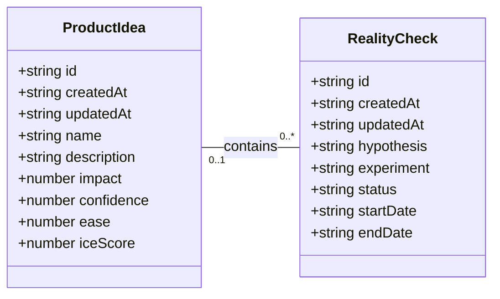

# Intent Prototyping: A Practical Guide to Building with Clarity (Part 2)

In Part 1 of this series, we explored the "lopsided horse" problem born from mockup-centric design and demonstrated how the seductive promise of vibe coding often leads to structural flaws. If you haven't read it yet, you can find it ==here==.

The main question remains: how might we close the gap between our design intent and a live prototype, so that we can iterate on real functionality from day one, without getting caught in the ambiguity trap? In other words, we need a way to build prototypes that are both fast to create and founded on a clear, unambiguous blueprint. The answer is a more disciplined process I call **Intent Prototyping** (kudos to Marco Kotrotsos who coined [Intent-Oriented Programming](https://kotrotsos.medium.com/intent-oriented-programming-bridging-human-thought-and-ai-machine-execution-3a92373cc1b6)). This method embraces the power of AI-assisted coding but rejects ambiguity, putting the designer's explicit _intent_ at the very center of the process. It receives a holistic expression of *intent* (sketches for screen layouts, conceptual model description, boxes-and-arrows for user flows) and uses it to generate a live, testable prototype.

![[Summary.excalidraw|500]]

This method solves the concerns we've discussed in Part 1 in the best way possible:

- **Unlike static mockups,** the prototype is fully interactive and can be easily populated with a big amount of realistic data. This lets us test the system's underlying logic as well as its surface.
- **Unlike a vibe-coded prototype,** it is built from a stable, unambiguous specification. This prevents the conceptual model failures and design debt that happen when things are unclear. The engineering team doesn't need to reverse-engineer a black box or become "code archaeologists," to guess at the designer's vision, as they receive not only a live prototype, but also a clearly documented design intent behind it.

This combination makes the method especially suited for designing complex enterprise applications. It allows us to test the system's most critical point of failure, its underlying structure, with a speed and flexibility that was previously impossible. Furthermore, the process is built for iteration. You can explore as many directions as you want, simply by changing the intent, and evolve the design based on what you learn from user testing.

### My Workflow

To illustrate this process in action, let's walk through a case study. It's the very same example I've used to illustrate the vibe coding trap: a simple tool to track tests to validate product ideas. You can find the complete project, including all the source code and documentation files discussed below, in this [GitHub repository](https://github.com/YegorGilyov/reality-check)

#### Step 1: Expressing an *intent*

Imagine we've already done proper research, and having mused on the defined problem, I begin to form a vague idea of what the solution might look like. I need to capture this idea immediately, so I quickly sketch it out:

![[01. Projects/Intent prototyping/Article/Illustrations/Sketch 01.excalidraw|700]]

In this example I used Excalidraw, but the tool doesn't really matter. Note that we deliberately keep it rough, as visual details are not something we need to focus on at this stage. And we are not going to be stuck here: we want to make a leap from this initial sketch directly to a live prototype that we can put in front of potential users. Polishing those sketches would not bring us any closer to achieving our goal.

What we need to move forward is to add to those sketches just enough details so that they may serve as a sufficient input for a junior frontend developer (or, in our case, an AI assistant). This requires explaining the following:

- Navigational paths (clicking here takes you to). 
- Interaction details that can't be shown in a static picture (e.g. non-scrollable areas, adaptive layout, drag-and-drop behavior).
- What parts might make sense to build as reusable components.
- Which components from the design system (I'm using [Ant Design Library](https://ant.design/)) should be used. 
- Any other comments that help understand how this thing should work (while sketches illustrate how it should look).

Having added all those details, we end up with such an annotated sketch:

![[01. Projects/Intent prototyping/Article/Illustrations/Sketch 02.png|700]]

As you see, this sketch covers both the Visualization and Flow aspects. You may ask, what about the Conceptual Model? Without that part, the expression of our *intent* will not be complete. One way would be to add it somewhere in the margins of the sketch (for example, as an UML Class Diagram), and I would do so in the case of a more complex application, where the model cannot be simply derived from the UI. But in our case we can save effort and ask an LLM to generate a comprehensive description of the conceptual model based on the sketch. 

For tasks of this sort the LLM of my choice is Gemini 2.5 Pro. What is important is that this is a multimodal model that can accept not only text but also images as input (latest models from OpenAI and Anthropic also fit that criteria). I use Google AI Studio, as it gives me enough control and visibility into what's happening:

![[Google AI Studio.png|700]]

*All the prompts that I use here and below can be found in the appendix. Note that all the prompts are not custom tailored to any particular project, they are supposed to be reused as they are.*

As a result, Gemini gives us a description and the following diagram:



The diagram might look technical, but I believe that a clear understanding of all objects, their attributes, and relationships between them is key for good design. That's why I consider the Conceptual Model to be an essential part of expressing *intent*, along with the Flow and Visualization.

As a result of this step, our *intent* is fully expressed in two files: `Sketch.png` and `Model.md`. This will be our durable source of truth.

#### Step 2: Preparing a spec and a plan

The purpose of this step is to create a comprehensive technical specification and a step-by-step plan. Most of the work here is done by AI, you just need to keep an eye on it.

I separate the Data Access Layer and the UI layer, and create specifications for them using two different prompts (see appendices 2 and 3). The output of the first prompt (the Data Access Layer spec) serves as an input for the second one. Note that as an additional input we give the guidelines tailored for prototyping needs (see appendices 8, 9, and 10). They are not specific for this project. The technical approach encoded in those guidelines is out of this article scope.

As a result, Gemini provides us with content for `DAL.md` and `UI.md`. Although in most cases this result is quite reliable enough, you might want to scrutinize the output. You don't need to be a real programmer to make sense of it, but some level of programming literacy would be really helpful. However, even if you don't have such skills, don't get discouraged. The good news is that if you don't understand something, you always know who to ask. Do it in Google AI Studio before refreshing the context window. If you believe you've spotted a problem, let Gemini know and it will either fix it or explain why the suggested approach is actually better.

It's important to remember that by their nature LLMs are not deterministic and, to put it simply, can be forgetful about small details, especially when it comes to details in sketches. Fortunately, you don't have to be an expert to notice that the "Delete" button, which is in the upper right corner of the sketch, is not mentioned in the spec. Don't get me wrong: Gemini does a stellar job most of the time, but there are still times when it slips up. Just let it know about problems you've spotted and everything will be fixed.

Once we have `Sketch.png`, `Model.md`, `DAL.md`, `UI.md`, and we have reviewed the specs, we can grab a coffee. We deserve it: our technical design documentation is complete. It will serve as a stable foundation for building the actual thing, without deviating from our original intent, and ensuring that all components fit together perfectly, and all layers are stacked correctly.

One last thing we can do before moving on to the next steps is to prepare a step-by-step plan. We split that plan into two parts: one for the Data Access Layer, and another one for the UI. You can find prompts I use to create such a plan in appendices 4 and 5.

#### Step 3: Executing the plan

To start building the actual thing, we need to switch to another category of AI tools. Up until this point we have relied on Generative AI. It excels at creating new content (in our case, specifications and plans) based on a single prompt. I'm using Google Gemini 2.5 in Google AI Studio, but other similar tools may also fit such one-off tasks: ChatGPT, Claude, Grok, DeepSeek. 

However, at this step, this wouldn't be enough. Building a prototype based on specs and according to a plan requires an AI that can read context from multiple files, execute a sequence of tasks, and maintain coherence. A simple generative AI can't do this. It would be like asking a person to build a house by only ever showing them a single brick. What we need is an agentic AI, that can be given the full house blueprint and a project plan, and then get to work building the foundation, framing the walls, and adding the roof in the correct sequence. 

My coding agent of choice is Google Gemini CLI, simply because Gemini 2.5 Pro serves me well and I don't think we need any middleman like Cursor or Windsurf (which would use Claude, Gemini, or GPT under the hood anyway). If I used Claude, my choice would be Claude Code, but since I'm sticking with Gemini, Gemini CLI it is. But if you prefer Cursor or Windsurf, I believe you can apply the same process with your favourite tool.

Before tasking the agent, we need to create a basic template for our React application. I won't go into this here. You can find plenty of tutorials on how to scaffold an empty React project using Vite.

Then we put all our files into that project:

![[docs.png|500]]

Once the basic template with all our files is ready, we open Terminal, go to the folder where our project resides, and type "gemini":

![[Gemini CLI.png|700]]
And we send the prompt to build the Data Access Layer (see appendix 6). That prompt implies step-by-step execution, so upon completion of each step I send the following:

```markdown
Thank you! Now please move to the next task.
Remember that you must not make assumptions based on common patterns, always verify it with the actual data from the spec. 
After each task, stop, so that I can test it. Don’t move to the next task before I tell you to do so.
```

As the last task in the plan, the agent builds a special page where we can test all the capabilities of our Data Access Layer, so that we can manually test it. It may look like this:

![[dal-test.png|700]]

It doesn't look fancy, to say the least, but it allows us to ensure that the Data Access Layer works correctly before we proceed with building the final UI.

And finally we clear the Gemini CLI context window to give it more headspace and send the prompt to build the UI (see appendix 7). This prompt also implies step-by-step execution. Upon completion of each step we test how it works and how it looks, following the "Manual Testing Plan" from `UI-plan.md`. I have to say that despite the fact that the sketch has been uploaded to the model context and in general Gemini tries to follow it, attention to visual detail is not one of its strengths (yet). Usually a few additional nudges are needed at each step to improve the look and feel: 

![[before-after.excalidraw|700]]

Once I'm happy with the result of a step, I ask Gemini to move on:

```markdown
Thank you! Now please move to the next task.
Make sure you build the UI according to the sketch, this is very important. Remember that you must not make assumptions based on common patterns, always verify it with the actual data from the spec and the sketch.  
After each task, stop, so that I can test it. Don’t move to the next task before I tell you to do so.
```

Before long, the result looks like this, and in every detail it works exactly as we *intended*:

![[final.excalidraw|700]]

The prototype is up and running and looking nice. Does it mean that we are done with our work? Surely not, the most fascinating part is just beginning. 

#### Step 4: Learning and iterating

It's time to put the prototype in front of potential users and learn more about whether this solution relieves their pain or not.

And as soon as we learn something new, we iterate. We adjust or extend the sketches and the conceptual model, based on that new input we update the specifications, create plans to make changes according to the new specifications, and execute those plans. In other words, for every iteration we repeat the steps I've just walked you through. 

---

This four-step workflow may create an impression of a somewhat heavy process that requires too much thinking upfront and doesn't really facilitate creativity. But before jumping to that conclusion, consider the following:

- In practice only the first step requires real effort, as well as learning in the last step. AI does most of the work in between, you just need to keep an eye on it.
- Individual iterations don't need to be big. You can start with a [Walking Skeleton](https://wiki.c2.com/?WalkingSkeleton): the bare minimum implementation of the thing you have in mind, and add more substance in subsequent iterations. You are welcome to change your mind about the overall direction in between iterations.
- And last but not least, maybe the idea of "think before you do" is not something you need to run away from. A clear and unambiguous statement of intent can prevent many unnecessary mistakes and save a lot of effort down the road.

### Intent Prototyping vs. Other Methods

There is no method that fits all situations, and Intent Prototyping is not an exception. Like any specialized tool, it has a specific purpose. The most effective teams are not those who master a single method, but those who understand which approach to use to mitigate the most significant risk at each stage. The table below gives you a way to make this choice clearer. It puts Intent Prototyping next to other common methods and tools and explains each one in terms of the primary goal it helps achieve and the specific risks it is best suited to mitigate.

| Method/Tool                                     | Goal                                                                                                                                                                         | Risks it is best suited to mitigate                                                                              | Examples                                                                                                                                              | Why                                                                                                                                                                                                                                |
| :---------------------------------------------- | :--------------------------------------------------------------------------------------------------------------------------------------------------------------------------- | :--------------------------------------------------------------------------------------------------------------- | :---------------------------------------------------------------------------------------------------------------------------------------------------- | :--------------------------------------------------------------------------------------------------------------------------------------------------------------------------------------------------------------------------------- |
| Intent Prototyping                              | To rapidly iterate on the fundamental architecture of a data-heavy application with a complex conceptual model, sophisticated business logic, and non-linear user flows.<br> | Building a system with a flawed or incoherent conceptual model, leading to critical bugs and costly refactoring. | - A CRM (Customer Relationship Management system).<br>- A Resource Management Tool.  <br>- A No-Code Integration Platform (admin's UI).               | It enforces conceptual clarity. This not only de-risks the core structure but also produces a clear, documented blueprint that serves as a superior specification for the engineering handoff.                                     |
| Vibe Coding (Conversational)                    | To rapidly explore interactive ideas through improvisation.  <br>                                                                                                            | Losing momentum because of analysis paralysis.                                                                   | - An interactive data table with live sorting/filtering. <br>- A novel navigation concept.  <br>- A proof-of-concept for a single, complex component. | It has the smallest loop between an idea conveyed in natural language and an interactive outcome.                                                                                                                                  |
| Axure                                           | To test complicated conditional logic within a specific user journey, without having to worry about the whole system works.<br>                                              | Designing flows that break when users don't follow the "happy path."                                             | - A multi-step e-commerce checkout. <br>- A software configuration wizard. <br>- A dynamic form with dependent fields.                                | It's made to create complex `if-then` logic and manage variables visually. This lets you test complicated paths and edge cases in a user journey without writing any code.                                                         |
| Figma                                           | To make sure that the user interface looks good, aligns with the brand, and has a clear information architecture.<br>                                                        | Making a product that looks bad, doesn't fit with the brand, or has a layout that is hard to understand.         | - A marketing landing page.  <br>- A user onboarding flow.  <br>- Presenting a new visual identity.                                                   | It excels at high-fidelity visual design and provides simple, fast tools for linking static screens.                                                                                                                               |
| ProtoPie, Framer                                | To make high-fidelity micro-interactions feel just right.    <br>                                                                                                            | Shipping an application that feels cumbersome and unpleasant to use because of poorly executed interactions.     | - A custom pull-to-refresh animation. <br>- A fluid drag-and-drop interface.  <br>- An animated chart or data visualization.                          | These tools let you manipulate animation timelines, physics, and device sensor inputs in great detail. Designers can carefully work on and test the small things that make an interface feel really polished and fun to use.       |
| Low-code / No-code Tools (e.g., Bubble, Retool) | To create a working, data-driven app as quickly as possible.  <br><br>                                                                                                       | The application will never be built because traditional development is too expensive.                            | - An internal inventory tracker.  <br>- A customer support dashboard.  <br>- A simple directory website.                                              | They put a UI builder, a database, and hosting all in one place. The goal is not merely to make a prototype of an idea, but to make and release an actual, working product. This is the last step for many internal tools or MVPs. |

The key takeaway is that each method is a specialized tool for mitigating a specific type of risk. For example, Figma de-risks the visual presentation. ProtoPie de-risks the feel of an interaction. Intent Prototyping is in a unique position to tackle the most foundational risk in complex applications: building on a flawed or incoherent conceptual model.

### Bringing It All Together

The era of the "lopsided horse" design, sleek on the surface but structurally unsound, is a direct result of the trade-off between fidelity and flexibility. This trade-off has led to a process filled with redundant effort and misplaced focus. Intent Prototyping, powered by modern AI, eliminates that conflict. It's not just a shortcut to building faster; it's a fundamental shift in how we design. By putting a clear, unambiguous *intent* at the heart of the process, it lets us get rid of the redundant work and focus on architecting a sound and robust system.

There are three major benefits to this renewed focus. First, by going straight to live, interactive prototypes, we shift our validation efforts from the surface to the deep, testing the system's actual logic with users from day one. Second, the very act of documenting the design *intent* makes us be clear about our ideas, ensuring that we fully understand the system's underlying logic. Finally, this documented *intent* becomes a durable source of truth, eliminating the ambiguous handoffs and the redundant, error-prone work of having engineers reverse-engineer a designer's vision from a black box.

Ultimately, Intent Prototyping changes the object of our work. It allows us to move beyond creating _pictures of a product_ and empowers us to become architects of _blueprints for a system_. With the help of AI, we can finally make the live prototype the primary canvas for ideation, not just a high-effort afterthought.