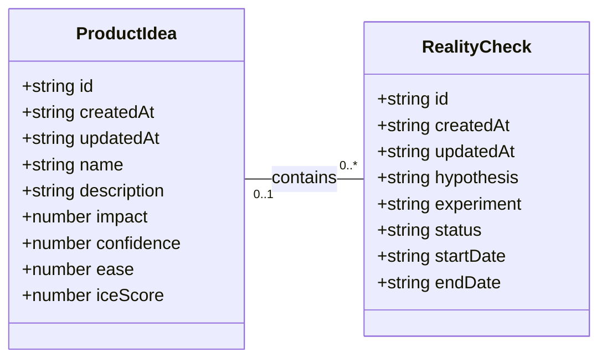

# Conceptual Model

This document outlines the conceptual model for the application, derived from the provided UI sketches. It uses a UML class diagram in Mermaid format to visualize the entities and their relationships.

## Mermaid UML Class Diagram

## Entities

### ProductIdea
Represents a potential product or feature concept that the team wants to explore. It's evaluated using the ICE scoring framework.

-   **`id`** (string): A unique identifier for the product idea.
-   **`createdAt`** (string, ISO 8601 format): The timestamp when the product idea was first created.
-   **`updatedAt`** (string, ISO 8601 format): The timestamp of the last update to the product idea.
-   **`name`** (string): The concise title of the product idea (e.g., "AI-Powered Grocery List"). This is displayed prominently on cards and detail views.
-   **`description`** (string): A more detailed explanation of what the product idea entails.
-   **`impact`** (number): A numerical score (e.g., 1-10) representing the potential positive effect this idea could have if realized.
-   **`confidence`** (number): A numerical score (e.g., 1-10) representing the team's belief in their ability to successfully execute the idea and achieve the estimated impact.
-   **`ease`** (number): A numerical score (e.g., 1-10) representing how easy it would be to implement the idea, considering time and resources.
-   **`iceScore`** (number): The calculated score (Impact × Confidence × Ease) used to prioritize ideas. Although calculated, it is included as an attribute to facilitate sorting and display as shown in the UI.

### RealityCheck
Represents a specific hypothesis and experiment designed to validate or invalidate an assumption related to a `ProductIdea`.

-   **`id`** (string): A unique identifier for the reality check.
-   **`createdAt`** (string, ISO 8601 format): The timestamp when the reality check was first created.
-   **`updatedAt`** (string, ISO 8601 format): The timestamp of the last update to the reality check.
-   **`hypothesis`** (string): The core assumption being tested, framed as a "We believe that..." statement.
-   **`experiment`** (string): The plan to test the hypothesis, framed as a "To verify that, we will..." statement.
-   **`status`** (string): The current stage of the reality check. Possible values from the UI are "New", "In Progress", "Proved", "Disproved". This determines which column the card appears in on Kanban boards.
-   **`startDate`** (string, ISO 8601 format): The planned start date of the experiment.
-   **`endDate`** (string, ISO 8601 format): The planned end date of the experiment.

## Relationships

### ProductIdea to RealityCheck (`contains`)
This one-to-many relationship links a product idea to the experiments designed to test its underlying assumptions.

-   **Cardinality**: A `ProductIdea` can be associated with zero or many (`0..*`) `RealityChecks`. A `RealityCheck` is associated with zero or one (`0..1`) `ProductIdea`.
-   **Behavior**: This relationship is optional. A `ProductIdea` can exist without any `RealityChecks`. A `RealityCheck` can also be created independently ("Not connected to any idea") and later linked to a `ProductIdea`. The connection is managed via the `Reality Check Form`, where a user can select an existing `ProductIdea`. The status of all associated `RealityChecks` is summarized on the `ProductIdea` card.